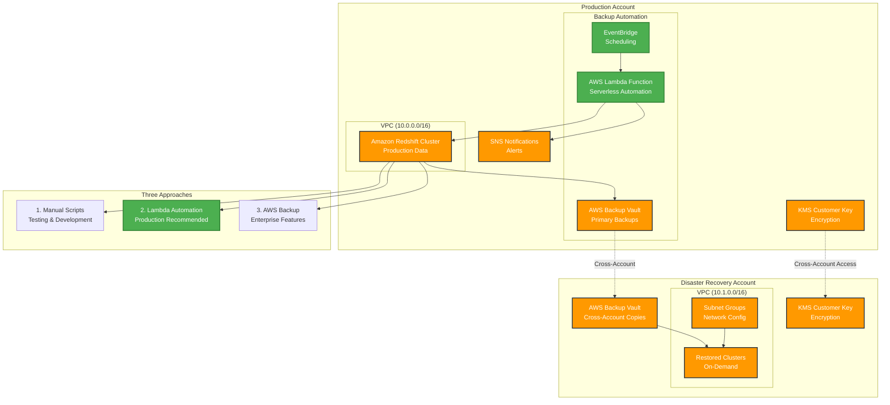

# Amazon Redshift Cross-Account Backup for Financial Services

This AWS sample demonstrates three approaches for implementing cross-account Amazon Redshift backup solutions, specifically designed for Financial Services Industry (FSI) airgap and disaster recovery requirements.

1. **Native Amazon Redshift Snapshot Sharing** - Direct cross-account snapshot sharing with manual scripts
2. **AWS Lambda-Based Automation** - Serverless automation of native snapshot sharing (recommended)
3. **AWS Backup Integration** - Centralized backup management with cross-account capabilities

## Demo Components

### Infrastructure
- CloudFormation templates for all approaches
- VPC, subnets, KMS keys, and IAM roles
- Redshift cluster in source account
- Backup vaults and networking in target account

### Automation Options
- **Manual Scripts**: Python scripts for testing and one-off operations
- **Lambda Functions**: Serverless automation with EventBridge scheduling
- **AWS Backup**: Managed service with built-in automation

### Documentation
- Detailed setup guides and troubleshooting
- Cost analysis and feature comparison
- Best practices and security considerations

## Quick Start Options

### Option 1: Full Demo Environment
```bash
./quick-deploy.sh          # Deploy infrastructure
python3 scripts/native_snapshot_demo.py    # Test native approach
python3 scripts/aws_backup_demo.py         # Test AWS Backup
./cleanup.sh               # Clean up resources
```

### Option 2: Lambda-Based Production Solution (Recommended)
```bash
./quick-deploy.sh          # Deploy infrastructure
./deploy-lambda-backup.sh  # Deploy serverless automation
# Automated backups now running on schedule
```

### Option 3: AWS Backup Solution
```bash
./quick-deploy.sh          # Deploy infrastructure (includes AWS Backup)
# Automated backups running via AWS Backup service
```

## Architecture Overview

### High-Level Architecture



### Key Components

- **Production Account**: Contains the live Amazon Redshift cluster and backup automation
- **DR Account**: Isolated environment for disaster recovery with cross-account access
- **Three Approaches**: Choose based on your operational requirements and compliance needs
- **Encryption**: End-to-end encryption using AWS KMS customer-managed keys
- **Automation**: Serverless scheduling with AWS Lambda and EventBridge (recommended)

This solution supports Financial Services regulatory requirements for:
- **Data Residency**: Cross-account isolation with controlled access
- **Disaster Recovery**: Automated backup and restoration capabilities  
- **Compliance**: Comprehensive audit trails and encryption
- **Cost Optimization**: Multiple approaches to balance cost and features

📋 **For detailed architecture diagrams of all three approaches, see [Architecture Diagrams](docs/architecture-diagrams.md)**


## Key Features

- ✅ **FSI-Compliant Architecture** - Designed for financial services regulatory requirements
- ✅ **Multiple Implementation Options** - Choose the approach that fits your needs
- ✅ **Production-Ready** - Includes monitoring, alerting, and automated cleanup
- ✅ **Cost-Optimized** - Native approach saves ~50% on storage costs vs AWS Backup
- ✅ **Serverless Automation** - AWS Lambda-based scheduling with no infrastructure overhead
- ✅ **Enterprise Security** - Cross-account KMS encryption and least-privilege IAM
- ✅ **Infrastructure as Code** - Complete AWS CloudFormation templates
- ✅ **Comprehensive Documentation** - Setup guides, cost analysis, and best practices

## Cost Comparison (1TB Cluster)

| Approach | Monthly Cost | Features | Best For |
|----------|-------------|----------|----------|
| **Native (Manual)** | ~$24.58 | Basic automation | Testing, development |
| **Native (Lambda)** | ~$24.81 | Serverless automation | **Production (Recommended)** |
| **AWS Backup** | ~$51.25 | Enterprise features | Compliance-heavy environments |

*Costs based on US East (N. Virginia) region pricing as of 2025. Actual costs may vary.*

See `docs/comparison-analysis.md` for detailed analysis.

## Use Cases

This solution is particularly valuable for:

- **Financial Services**: Meeting regulatory requirements for data backup and disaster recovery
- **Healthcare**: HIPAA-compliant cross-account data protection
- **Government**: FedRAMP and other compliance frameworks requiring airgap solutions
- **Enterprise**: Multi-account strategies with centralized backup management
- **Disaster Recovery**: Cross-region and cross-account backup strategies

## Security

This sample implements AWS security best practices:
- All data encrypted at rest using AWS KMS customer-managed keys
- Cross-account access using least-privilege IAM roles
- VPC isolation for network security
- Comprehensive audit logging via AWS CloudTrail
- Secure credential management using AWS profiles

## Disclaimer

This sample code is provided for demonstration purposes and should be thoroughly tested and customized for production use. Always follow your organization's security and compliance requirements.
##
 Contributing

See [CONTRIBUTING.md](CONTRIBUTING.md) for information on how to contribute to this project.

## License

This library is licensed under the Apache License 2.0. See the [LICENSE](LICENSE) file for details.

## Support

This is a sample solution provided for educational and demonstration purposes. For production support, please work with your AWS Solutions Architect or contact AWS Support.

---

**AWS Samples** | **Financial Services Industry** | **Amazon Redshift** | **Disaster Recovery**