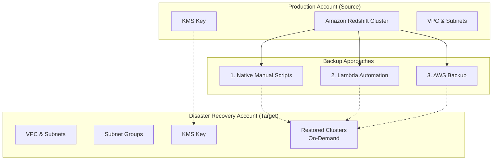
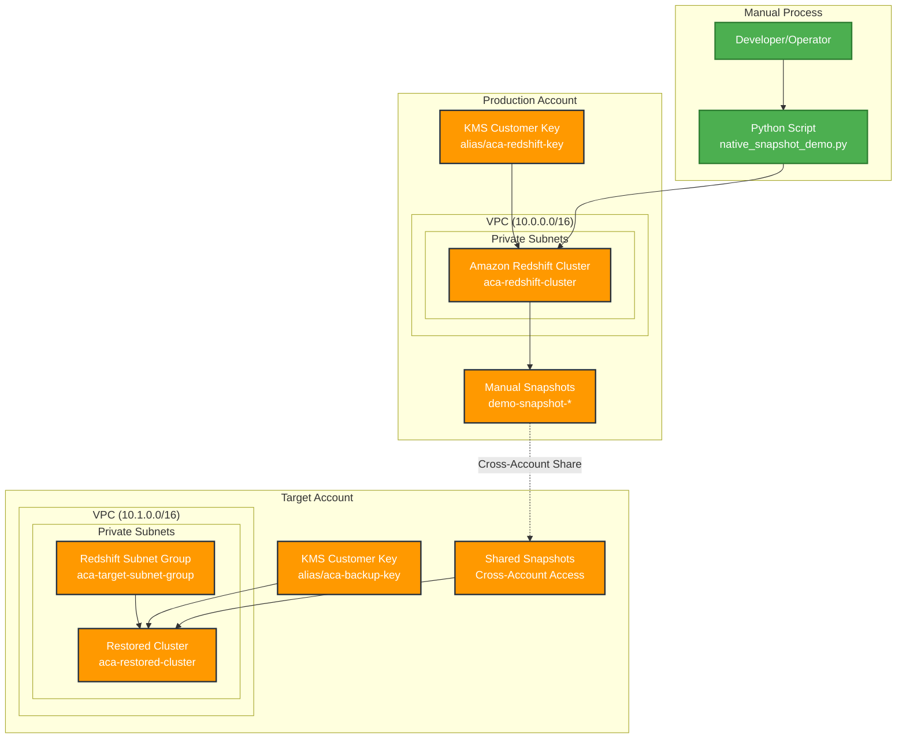
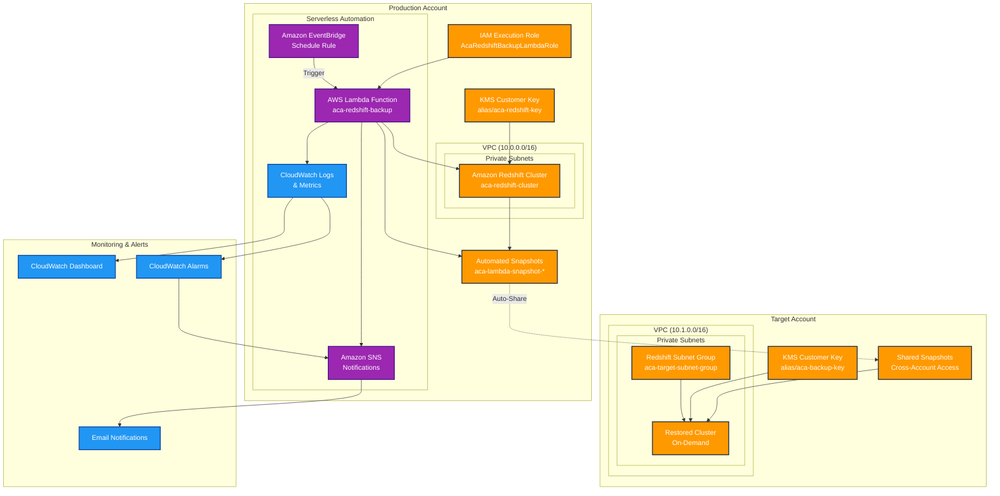
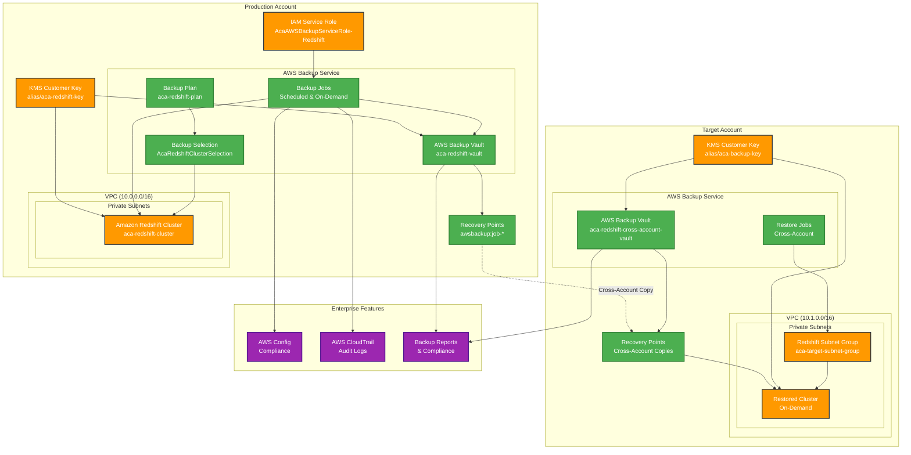
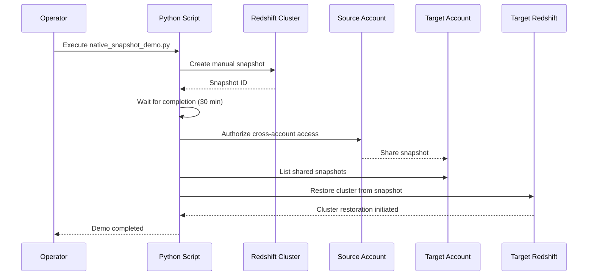
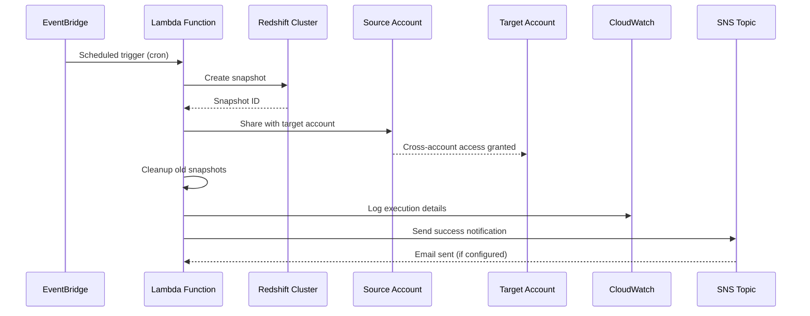
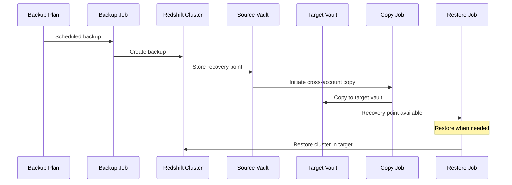
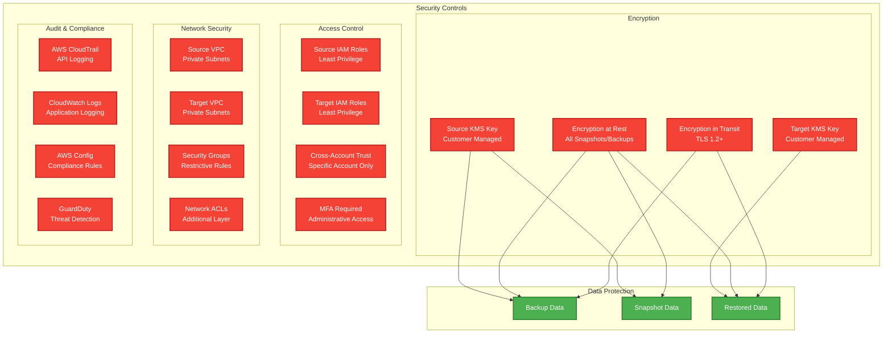
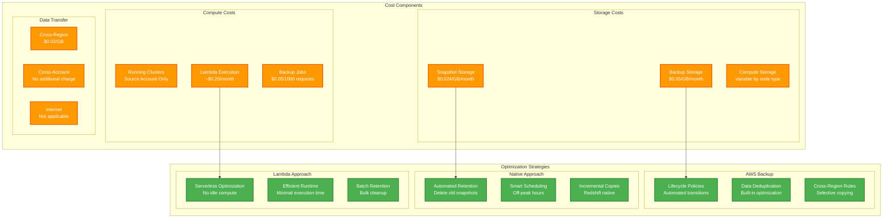
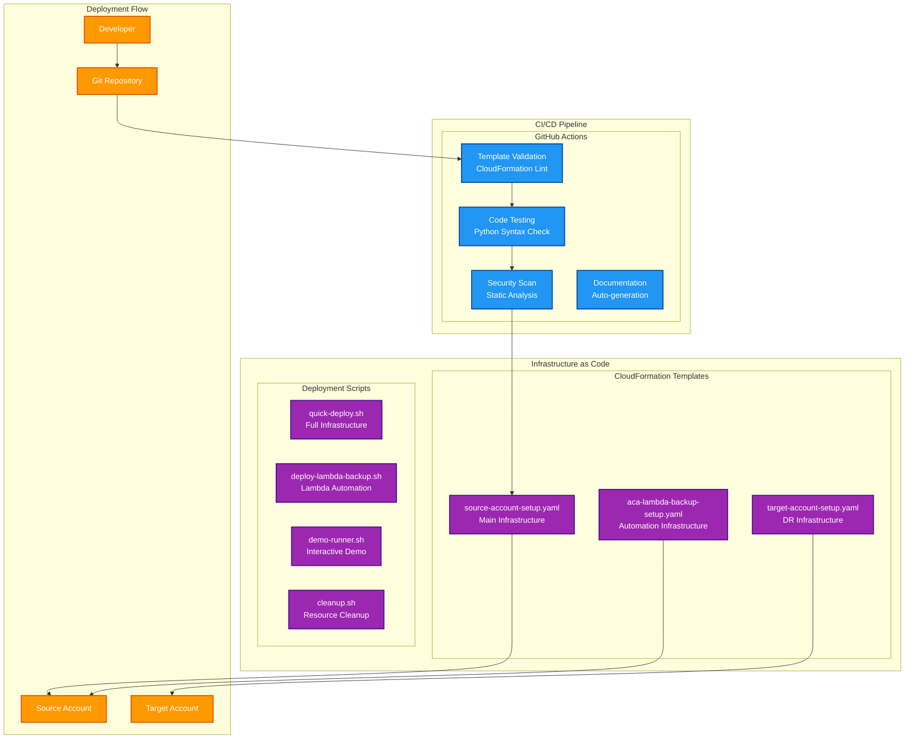

# Architecture Diagrams

This document provides detailed architecture diagrams for all three Amazon Redshift cross-account backup approaches.

## Overview Architecture

## 1. Native Manual Scripts Architecture

## 2. Lambda-Based Automation Architecture

## 3. AWS Backup Integration Architecture

## Data Flow Diagrams

### Native Manual Process Flow

### Lambda Automation Flow

### AWS Backup Process Flow

## Security Architecture

## Cost Optimization Architecture

## Deployment Architecture

These diagrams provide comprehensive visual documentation of the architecture for all three approaches, including security, cost optimization, and deployment considerations.