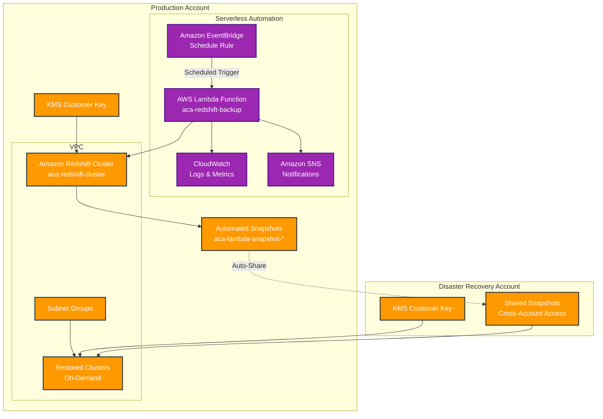

# ACA Lambda Automation Guide

This guide covers the serverless Lambda-based automation solution for ACA Redshift cross-account backups.

## Overview

The Lambda automation provides production-ready backup scheduling with minimal operational overhead and significant cost savings compared to AWS Backup.

## Architecture



## Key Components

### 1. Lambda Function (`aca-redshift-backup`)
- **Runtime**: Python 3.9
- **Timeout**: 15 minutes
- **Memory**: 512 MB
- **Trigger**: EventBridge scheduled events
- **Permissions**: Redshift snapshot operations, cross-account sharing

### 2. EventBridge Schedule Rule
- **Configurable frequency**: Daily, hourly, or custom cron expressions
- **Automatic triggering**: No manual intervention required
- **Reliable execution**: Built-in retry mechanisms

### 3. CloudWatch Monitoring
- **Function logs**: Detailed execution logging
- **Metrics**: Success/failure rates, execution duration
- **Alarms**: Automatic alerts on failures

### 4. SNS Notifications
- **Email alerts**: Optional email notifications on failures
- **Extensible**: Can add Slack, Teams, or other integrations

## Deployment

### Prerequisites
- Source and target account infrastructure deployed
- AWS CLI configured with `source` and `target` profiles
- Appropriate IAM permissions for CloudFormation deployment

### Quick Deployment
```bash
./deploy-lambda-backup.sh
```

### Manual Deployment
```bash
aws cloudformation create-stack \
    --stack-name aca-lambda-backup \
    --template-body file://cloudformation/aca-lambda-backup-setup.yaml \
    --parameters ParameterKey=TargetAccountId,ParameterValue=058264155998 \
                 ParameterKey=BackupSchedule,ParameterValue="cron(0 2 * * ? *)" \
                 ParameterKey=RetentionDays,ParameterValue=7 \
                 ParameterKey=NotificationEmail,ParameterValue=admin@aca.com \
    --capabilities CAPABILITY_NAMED_IAM \
    --region us-east-1 \
    --profile source
```

## Configuration Options

### Backup Schedules

| Schedule | Expression | Description |
|----------|------------|-------------|
| **Daily** | `cron(0 2 * * ? *)` | Every day at 2 AM UTC |
| **Twice Daily** | `cron(0 2,14 * * ? *)` | 2 AM and 2 PM UTC |
| **Every 12 Hours** | `rate(12 hours)` | Every 12 hours |
| **Every 6 Hours** | `rate(6 hours)` | Every 6 hours |
| **Weekdays Only** | `cron(0 2 ? * MON-FRI *)` | Monday-Friday at 2 AM |
| **Custom** | `cron(0 */4 * * ? *)` | Every 4 hours |

### Retention Policies

| Retention | Use Case | Storage Impact |
|-----------|----------|----------------|
| **3 days** | Development/Testing | Minimal storage |
| **7 days** | Standard production | Balanced cost/recovery |
| **14 days** | Critical systems | Higher storage cost |
| **30 days** | Compliance requirements | Maximum storage cost |

### Environment Variables

The Lambda function uses these environment variables:

```python
CLUSTER_IDENTIFIER = "aca-redshift-cluster"
TARGET_ACCOUNT_ID = "058264155998"
RETENTION_DAYS = "7"
```

## Operation

### Automatic Execution
- Lambda runs on the configured schedule
- Creates timestamped snapshots: `aca-lambda-snapshot-YYYYMMDD-HHMMSS`
- Immediately shares snapshots with target account
- Cleans up snapshots older than retention period
- Logs all operations to CloudWatch

### Manual Execution
```bash
# Trigger backup manually
aws lambda invoke \
    --function-name aca-redshift-backup \
    --payload '{"cluster_identifier":"aca-redshift-cluster","target_account_id":"058264155998"}' \
    --region us-east-1 \
    --profile source \
    output.json

# View result
cat output.json | python3 -m json.tool
```

### Event Payload Format
```json
{
  "cluster_identifier": "aca-redshift-cluster",
  "target_account_id": "058264155998",
  "retention_days": 7
}
```

### Response Format
```json
{
  "statusCode": 200,
  "snapshot_id": "aca-lambda-snapshot-20250918-143022",
  "cluster_identifier": "aca-redshift-cluster",
  "target_account_id": "058264155998",
  "timestamp": "2025-09-18T14:30:22.123456",
  "shared": true,
  "cleaned_up_snapshots": 2,
  "status": "completed"
}
```

## Monitoring

### CloudWatch Logs
```bash
# View recent logs
aws logs tail /aws/lambda/aca-redshift-backup --follow --profile source

# Search for errors
aws logs filter-log-events \
    --log-group-name /aws/lambda/aca-redshift-backup \
    --filter-pattern "ERROR" \
    --profile source
```

### CloudWatch Metrics
- **Duration**: Function execution time
- **Errors**: Failed executions
- **Invocations**: Total function calls
- **Throttles**: Rate limiting events

### Custom Alarms
The deployment creates these alarms:
- **Lambda Errors**: Triggers on any function failure
- **Duration**: Alerts if execution time exceeds thresholds
- **Throttling**: Monitors rate limiting

## Troubleshooting

### Common Issues

#### 1. Lambda Timeout (15 minutes)
**Symptoms**: Function times out during snapshot creation
**Solutions**:
- Large clusters may take longer than 15 minutes
- Consider using Step Functions for longer workflows
- Monitor snapshot creation time and adjust expectations

#### 2. Snapshot Sharing Failures
**Symptoms**: Snapshots created but not shared
**Solutions**:
- Verify target account ID is correct
- Check cross-account KMS permissions
- Ensure IAM roles have proper permissions

#### 3. Retention Cleanup Issues
**Symptoms**: Old snapshots not being deleted
**Solutions**:
- Check IAM permissions for `redshift:DeleteClusterSnapshot`
- Verify snapshot naming pattern matches `aca-lambda-snapshot-*`
- Review CloudWatch logs for deletion errors

### Debugging Steps

1. **Check Lambda Logs**:
   ```bash
   aws logs describe-log-streams \
       --log-group-name /aws/lambda/aca-redshift-backup \
       --profile source
   ```

2. **Verify Snapshots**:
   ```bash
   # Source account snapshots
   aws redshift describe-cluster-snapshots \
       --cluster-identifier aca-redshift-cluster \
       --snapshot-type manual \
       --profile source

   # Target account shared snapshots
   aws redshift describe-cluster-snapshots \
       --snapshot-type manual \
       --owner-account 164543933824 \
       --profile target
   ```

3. **Test Manual Execution**:
   ```bash
   aws lambda invoke \
       --function-name aca-redshift-backup \
       --payload '{"cluster_identifier":"aca-redshift-cluster","target_account_id":"058264155998","retention_days":7}' \
       --region us-east-1 \
       --profile source \
       test-output.json
   ```

## Cost Optimization

### Lambda Costs
- **Execution time**: Typically 30-60 seconds per backup
- **Memory usage**: 512 MB allocated, ~100 MB used
- **Monthly cost**: ~$0.20 for daily backups

### Storage Costs
- **Snapshot storage**: $0.024/GB/month
- **Same as manual approach**: No additional markup
- **Retention management**: Automatic cleanup prevents cost accumulation

### Cost Comparison (1TB cluster, daily backups)
```
Lambda Automation:  $24.81/month
Manual Scripts:     $24.58/month (+ operational overhead)
AWS Backup:         $51.25/month

Savings vs AWS Backup: 52%
```

## Security

### IAM Permissions
The Lambda execution role has minimal required permissions:
- `redshift:CreateClusterSnapshot`
- `redshift:DescribeClusterSnapshots`
- `redshift:DeleteClusterSnapshot`
- `redshift:AuthorizeSnapshotAccess`
- `sts:GetCallerIdentity`

### Cross-Account Security
- KMS key permissions for target account decryption
- Snapshot sharing limited to specific target account
- No broad cross-account access granted

### Encryption
- All snapshots encrypted with customer-managed KMS keys
- Lambda logs encrypted at rest
- SNS topics support encryption in transit

## Maintenance

### Updates
- Lambda function code embedded in CloudFormation
- Updates deployed via CloudFormation stack updates
- Zero-downtime updates with proper versioning

### Monitoring
- Set up CloudWatch dashboards for key metrics
- Configure SNS notifications for operational alerts
- Regular review of backup success rates and timing

### Backup Validation
- Periodic restore testing in target account
- Verification of cross-account snapshot accessibility
- Monitoring of retention policy effectiveness

## Migration from Manual Scripts

### From Manual to Lambda
1. Deploy Lambda automation alongside existing manual process
2. Verify Lambda backups working correctly for 1 week
3. Disable manual backup processes
4. Update monitoring and alerting to use Lambda metrics

### Rollback Plan
1. Keep manual scripts available as backup
2. Lambda can be disabled by updating EventBridge rule
3. Manual execution still possible if needed
4. CloudFormation stack can be deleted to remove automation

## Best Practices

### Scheduling
- **Production**: Daily backups at low-usage hours (2-4 AM)
- **Critical systems**: Twice daily backups
- **Development**: Less frequent backups to save costs

### Retention
- **Balance cost vs recovery needs**
- **Compliance requirements** may dictate minimum retention
- **Monitor storage costs** and adjust retention as needed

### Monitoring
- **Set up alerts** for backup failures
- **Regular review** of backup success rates
- **Test restore procedures** periodically

### Documentation
- **Document backup schedules** and retention policies
- **Maintain runbooks** for common operational tasks
- **Keep contact information** updated for notifications